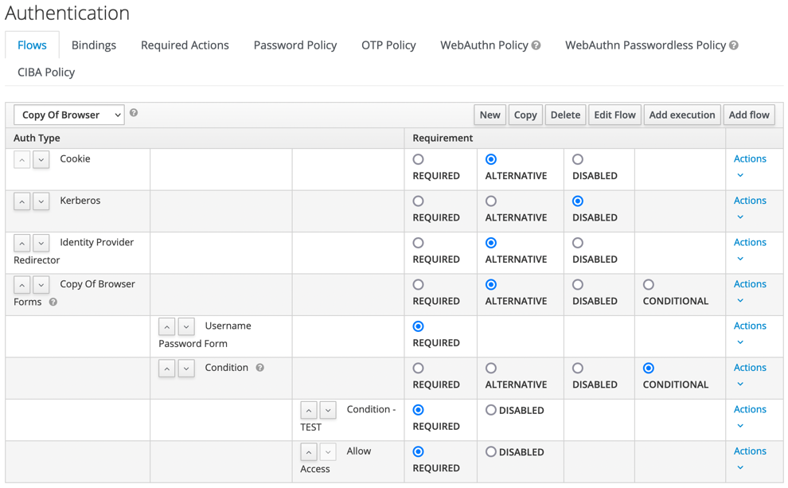
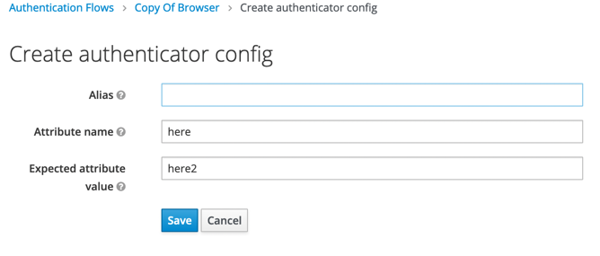

# Conditional Authenticator demo

**This repo shows a bug explained here : https://github.com/keycloak/keycloak/issues/10457**

## Build and run

```
mvn clean install
```

```
docker-compose up -d
```

## Test data

A realm "test" is provisioned with a user "test" (password "test").

### Bowser flow

A copy of the standard browser flow with our custom conditional authenticator : 



This flow is set for account-console.

## Reproduce bug

Compile and run this example.

Open the account console : http://127.0.0.1:8080/auth/realms/test/account/

Login with "test"/"test", it results in a "nullpointerexception".

It is the same bug when we add the conditional authenticator by hand. By default, it does not have any configuration.



Default values are presents, but because there is no "alias", the configuration is not instanciated.

If we define a configuration, the "export" will not save this configuration in the json file.